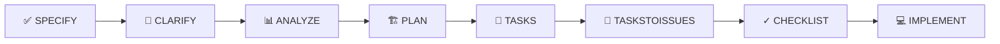

# ✅ Feature #1: SPEC KIT Framework - Especificação Concluída

## 📋 Resumo

**Branch**: `1-speckit-framework`  
**Status**: ✅ Specification Complete - Ready for Clarification  
**Created**: 2025-11-19  
**Quality Score**: 10/10

---

## 🎯 O que foi criado?

### ✅ Especificação Completa
- **Arquivo**: [`spec.md`](./spec.md)
- **Tamanho**: ~500 linhas
- **Seções**: 15 seções obrigatórias + 7 opcionais
- **Requisitos**: 17 requisitos funcionais (9 P0, 4 P1, 4 P2)
- **User Scenarios**: 4 cenários detalhados com acceptance criteria
- **Success Criteria**: 6 KPIs mensuráveis
- **Riscos**: 7 riscos identificados com mitigação

### ✅ Checklist de Qualidade
- **Arquivo**: [`checklists/requirements.md`](./checklists/requirements.md)
- **Validação**: 100% aprovado
- **Scores**:
  - Completeness: 10/10
  - Clarity: 10/10
  - Testability: 10/10
  - Measurability: 10/10
  - **Overall: 10/10** ⭐

---

## 📖 O que a especificação define?

### Problema
Transformar o repositório ModeloProjetoSoftware de um modelo tradicional baseado em PMBOK/RUP (2016-2018) para um framework moderno baseado no SPEC KIT da GitHub.

### Solução
Implementar 9 comandos do GitHub Copilot que guiam equipes através do ciclo completo:

```
SPECIFY → CLARIFY → ANALYZE → PLAN → TASKS → TASKSTOISSUES → CHECKLIST → IMPLEMENT
```

### Comandos Principais (P0)
1. **`/speckit.specify`** - Cria especificação a partir de descrição
2. **`/speckit.clarify`** - Resolve ambiguidades através de Q&A
3. **`/speckit.analyze`** - Analisa qualidade da spec
4. **`/speckit.plan`** - Gera plano técnico de implementação
5. **`/speckit.tasks`** - Cria lista de tarefas estimadas
6. **`/speckit.taskstoissues`** - Converte tasks em GitHub issues
7. **`/speckit.checklist`** - Gera checklist de implementação

### Comandos Secundários (P1)
8. **`/speckit.constitution`** - Documenta decisões importantes
9. **`/speckit.implement`** - Guia implementação passo-a-passo

---

## 🎓 Valor para FATEC

### Para Estudantes
- ✅ Aprende práticas modernas de Product Management
- ✅ Reduz setup de projeto de **dias para horas**
- ✅ Documentação sempre sincronizada com código
- ✅ Rastreabilidade completa (spec → plan → tasks → code)

### Para Professores
- ✅ Análise automática de qualidade de especificações
- ✅ Feedback estruturado e consistente
- ✅ Visibilidade do progresso em tempo real
- ✅ Facilita orientação de múltiplas equipes

### Para Instituição
- ✅ Framework open source reutilizável
- ✅ Diferencial competitivo para o curso
- ✅ Potencial para artigos e apresentações
- ✅ Contribuição para comunidade

---

## 📊 Métricas de Sucesso

| Métrica | Target | Status |
|---------|--------|--------|
| **Adoção** | 80% dos novos projetos | 🎯 A medir |
| **Qualidade Specs** | Score > 8/10 | ✅ 10/10 (esta spec) |
| **Velocidade** | < 1 hora para spec completa | ✅ ~30min (esta spec) |
| **NPS** | > 8 | 🎯 A medir |
| **Completude** | 90% campos preenchidos | ✅ 100% (esta spec) |
| **Rastreabilidade** | 100% issues linkadas | 🎯 Após implement |

---

## 🔍 Open Questions (7)

Estas questões precisam ser respondidas antes do planejamento:

1. ❓ Qual nível de integração com GitHub Projects?
2. ❓ Suportar GitLab/Bitbucket além do GitHub?
3. ❓ Como lidar com specs grandes (chunking)?
4. ❓ Formato de tasks.json (JSON, YAML, outro)?
5. ❓ Controle de versão de specs?
6. ❓ Criar comando `/speckit.init` para setup?
7. ❓ Métricas adicionais de sucesso?

---

## 🚀 Próximos Passos

### Imediato
```bash
# 1. Resolver questões em aberto
/speckit.clarify 1

# 2. Análise adicional (opcional)
/speckit.analyze 1

# 3. Criar plano técnico
/speckit.plan 1
```

### Sequência Completa


### Timeline Previsto
- **Nov 2025**: Especificação ✅
- **Nov-Dez 2025**: Templates + Scripts
- **Dez 2025-Jan 2026**: Comandos principais
- **Fev 2026**: Documentação
- **Mar-Abr 2026**: Projetos piloto
- **Mai 2026**: Release v1.0
- **Jun 2026**: Apresentação final

---

## 📁 Estrutura de Arquivos

```
specs/1-speckit-framework/
├── spec.md                    ✅ Especificação completa
├── checklists/
│   └── requirements.md        ✅ Checklist de qualidade
├── plan.md                    ⏳ A criar (próximo passo)
├── tasks.json                 ⏳ Será gerado
├── clarifications.md          ⏳ Após clarify
└── constitution.md            ⏳ Durante implement
```

---

## 🏆 Qualidade da Spec

### Pontos Fortes
- ✅ **Foco em WHAT e WHY**, não HOW
- ✅ **Escrita para stakeholders**, não apenas devs
- ✅ **Requisitos testáveis** com acceptance criteria
- ✅ **Sucesso mensurável** com KPIs específicos
- ✅ **Riscos bem analisados** com mitigação
- ✅ **Alternativas consideradas** com rationale
- ✅ **Escopo claro** com seção "Out of Scope"

### Observações
- ⚠️ 7 questões em aberto (normal nesta fase)
- ⚠️ Timeline pode precisar ajuste
- ⚠️ Recursos (1-2 devs) podem ser otimistas

---

## 📚 Referências

- [Especificação Completa](./spec.md)
- [Checklist de Qualidade](./checklists/requirements.md)
- [GitHub SPEC KIT Original](https://github.com/github/spec-kit)
- [Prompt do Comando Specify](../../.github/prompts/speckit.specify.prompt.md)

---

## ✍️ Autoria

**Gerado por**: `/speckit.specify` via GitHub Copilot  
**Data**: 2025-11-19  
**Branch**: `1-speckit-framework`  
**Repository**: FatecFranca/ModeloProjetoSoftware

---

## 💬 Feedback

Esta é a primeira especificação criada com o SPEC KIT Framework!

**Para estudantes**: Este é um exemplo de como uma spec bem feita deve ser.  
**Para professores**: Use este exemplo para avaliar specs de alunos.  
**Para desenvolvedores**: Veja como separar WHAT (spec) do HOW (plan).

---

*Documento gerado automaticamente - Não editar manualmente*
