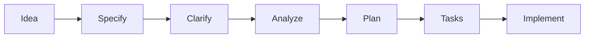

# Estrutura do Wiki Instrucional - SPEC KIT Framework

**Versão**: 1.0  
**Data**: 2025-11-19  
**Objetivo**: Transformar o wiki em material didático progressivo para alunos da FATEC

---

## Visão Geral

O wiki será reorganizado para servir como **material didático completo** sobre gerenciamento moderno de projetos de software, usando o SPEC KIT Framework como base prática. Todo conteúdo será em **português brasileiro** com linguagem acessível para estudantes.

---

## Estrutura de Páginas

### 📚 Nível 1: Fundamentos (Para Iniciantes)

#### **Home.md** - Página Inicial
**Tempo estimado**: 10 minutos de leitura

**Conteúdo**:
- O que é o SPEC KIT Framework?
- Por que substituímos PMBOK/RUP por abordagem ágil?
- Comparativo visual: Antes (PMBOK) vs. Depois (SPEC KIT)
- Público-alvo: alunos, professores, contribuidores
- Como navegar neste wiki (mapa do conteúdo)
- Pré-requisitos: Git básico, GitHub account, VS Code

**Elementos visuais**:


#### **Guia-Rapido.md** - Setup em 5 minutos
**Tempo estimado**: 30 minutos (5 min leitura + 25 min prática)

**Conteúdo**:
1. **Setup Inicial** (5 min)
   - Instalar pré-requisitos (Git, GitHub CLI, VS Code, Copilot)
   - Clonar repositório ModeloProjetoSoftware
   - Executar `/speckit.init` pela primeira vez
   - Verificar estrutura criada

2. **Primeira Especificação** (15 min)
   - Exemplo guiado: "Sistema de Login"
   - Executar `/speckit.specify "Sistema de login com email e senha"`
   - Entender estrutura gerada
   - Navegar pelas seções

3. **Primeiro Refinamento** (10 min)
   - Executar `/speckit.clarify 1`
   - Responder perguntas interativas
   - Ver spec atualizada

**Checkpoint**: ✅ Aluno criou sua primeira spec completa

#### **Glossario.md** - Termos Técnicos
**Formato**: Alfabético com exemplos práticos

**Exemplos de entradas**:
- **Acceptance Criteria** (Critérios de Aceitação): Lista verificável de condições que uma feature deve atender para ser considerada completa. *Exemplo: "[ ] Usuário consegue fazer login com email válido"*
- **Branch**: Ramificação do código que permite desenvolvimento isolado. No SPEC KIT, cada spec gera uma branch `N-nome-da-feature`.
- **Clarification** (Clarificação): Processo de resolver ambiguidades em uma especificação através de perguntas e respostas estruturadas.
- **P0/P1/P2**: Prioridades de requisitos (P0 = Must Have, P1 = Should Have, P2 = Nice to Have)

---

### 🔧 Nível 2: Comandos (Prática Detalhada)

#### **Comandos/Init.md** - Comando /speckit.init
**Estrutura padrão para cada comando**:

```markdown
# /speckit.init - Inicialização do Repositório

## O que faz?
Configura toda a infraestrutura do SPEC KIT no seu repositório em um único comando.

## Quando usar?
- Primeira vez configurando SPEC KIT em um projeto
- Ao criar novo repositório para projeto acadêmico
- Migrar projeto existente para SPEC KIT

## Como funciona?
[Diagrama passo-a-passo]

## Exemplo Prático
```bash
# No terminal do VS Code
/speckit.init
```

**Prompt interativo que aparecerá**:
```
✨ SPEC KIT Initialization
📁 Project name: MeuProjetoFATEC
👤 Default owner: João Silva
🔢 Starting spec number: 1
⚙️  Enable GitHub Actions validation? (y/n): y

Creating directories...
Installing templates...
Setup complete! 🎉
```

## O que foi criado?
[Tree view da estrutura]

## Exercício
1. Execute /speckit.init no seu repositório de teste
2. Explore cada diretório criado
3. Abra .specify/config.json e entenda as configurações
4. **Desafio**: Altere o owner padrão e execute novamente

## Erros Comuns
- ❌ "Directory already exists": Você já tem estrutura SPEC KIT. Use --force para sobrescrever
- ❌ "GitHub CLI not found": Instale gh cli primeiro
- ❌ "Permission denied": Verifique permissões de escrita no repositório

## Próximos Passos
Agora que seu repositório está configurado, aprenda a criar sua primeira spec: [Comandos/Specify.md]
```

**Repetir estrutura similar para**:
- **Comandos/Specify.md**
- **Comandos/Clarify.md**
- **Comandos/Analyze.md**
- **Comandos/Plan.md**
- **Comandos/Tasks.md**
- **Comandos/TasksToIssues.md**
- **Comandos/Checklist.md**
- **Comandos/Implement.md**
- **Comandos/Constitution.md**

---

### 💡 Nível 3: Boas Práticas (Avançado)

#### **Boas-Praticas.md**

**Seções**:

1. **Escrevendo Especificações de Qualidade**
   - Foco em WHAT e WHY, não HOW
   - Requisitos testáveis e mensuráveis
   - Critérios de aceitação claros
   - Exemplo: Spec boa vs. spec ruim (side-by-side)

2. **Organizando Features**
   - Quando quebrar em múltiplas specs
   - Gerenciando dependências entre features
   - Versionamento semântico de specs

3. **Trabalhando em Equipe**
   - Code review de specs
   - Sincronização com issues do GitHub
   - Comunicação de mudanças (constitution)

4. **Anti-Patterns Comuns**
   - ❌ Spec genérica demais ("Melhorar sistema")
   - ❌ Misturar implementação na spec
   - ❌ Requisitos não-testáveis ("Sistema deve ser rápido")
   - ❌ Esquecer de atualizar spec após mudanças

5. **Checklist de Qualidade**
   ```markdown
   - [ ] Todas as seções obrigatórias preenchidas?
   - [ ] Critérios de aceitação são verificáveis?
   - [ ] Linguagem clara e sem ambiguidades?
   - [ ] Exemplos concretos fornecidos?
   - [ ] Riscos identificados e mitigados?
   - [ ] Dependencies mapeadas?
   ```

#### **FAQ.md** - Perguntas Frequentes

**Categorias**:

**Setup e Instalação**
- Como instalo o GitHub Copilot?
- Posso usar SPEC KIT sem Copilot? (Resposta: Sim, com templates manuais)
- Funciona no Windows/Linux/Mac?

**Uso dos Comandos**
- Esqueci de criar branch antes de /speckit.specify, e agora?
- Posso editar a spec manualmente depois de gerada?
- Como desfazer um /speckit.clarify?

**Conceitos**
- Qual diferença entre P0, P1 e P2?
- O que é uma "feature"?
- Quando usar /speckit.constitution vs. editar spec?

**Projetos Acadêmicos**
- Como usar SPEC KIT no TCC?
- Professor pede documentação PMBOK, como adaptar?
- Como apresentar spec em banca?

**Troubleshooting**
- Comando não responde, o que fazer?
- GitHub CLI authentication failed
- Spec muito grande (> 5000 linhas)

---

### 🎯 Nível 4: Exercícios Práticos

#### **Exercicios/Modulo-1-Setup.md**

**Objetivo**: Dominar setup e primeiro spec

**Exercício 1: Setup Completo** (20 minutos)
- Criar repositório `meu-projeto-teste`
- Executar /speckit.init
- Verificar estrutura criada
- **Entrega**: Screenshot da estrutura de diretórios

**Exercício 2: Primeira Spec** (30 minutos)
- Criar spec para "Sistema de Cadastro de Alunos"
- Requisitos mínimos:
  - 3 campos obrigatórios
  - Validação de CPF
  - Listagem com paginação
- **Entrega**: Link para spec.md no GitHub

**Exercício 3: Clarificação** (20 minutos)
- Executar /speckit.clarify na spec do Ex 2
- Responder pelo menos 5 perguntas
- **Entrega**: clarifications.md gerado

**Gabarito**: (Link para specs de exemplo completas)

#### **Exercicios/Modulo-2-Planejamento.md**

**Objetivo**: Transformar spec em plano e tarefas

**Exercício 4: Geração de Plano** (30 minutos)
- Usar spec do Ex 2
- Executar /speckit.plan
- Analisar arquitetura sugerida
- **Entrega**: plan.md com comentários sobre escolhas técnicas

**Exercício 5: Quebra em Tarefas** (40 minutos)
- Executar /speckit.tasks
- Validar estimativas de esforço
- Ajustar dependências se necessário
- **Entrega**: tasks.json + justificativa das estimativas

**Desafio**: Criar issues no GitHub com /speckit.taskstoissues

#### **Exercicios/Projeto-Final.md**

**Projeto Integrador** (4-6 horas)

Criar especificação completa para um dos projetos:

**Opção A**: Sistema de Biblioteca
- Cadastro de livros e usuários
- Empréstimo/devolução
- Multas por atraso
- Relatórios

**Opção B**: API de E-commerce
- Catálogo de produtos
- Carrinho de compras
- Checkout
- Integração com pagamento

**Opção C**: Dashboard Analytics
- Coleta de métricas
- Visualizações
- Alertas
- Exportação de relatórios

**Entregáveis**:
1. Spec completa (spec.md)
2. Clarificações (clarifications.md)
3. Plano técnico (plan.md)
4. Tarefas (tasks.json)
5. Issues criadas no GitHub
6. README explicando decisões tomadas

**Critérios de Avaliação**:
- Completude da spec (30%)
- Qualidade dos requisitos (25%)
- Clareza e testabilidade (20%)
- Plano técnico coerente (15%)
- Estimativas realistas (10%)

---

### 📖 Nível 5: Referência e Histórico

#### **Apendice-PMBOK.md** - Conteúdo Legado

**Objetivo**: Preservar conhecimento histórico e demonstrar evolução

**Estrutura**:

```markdown
# Apêndice: PMBOK/RUP - Documentação Histórica

> ⚠️ **Nota**: Este conteúdo é mantido para referência histórica. 
> Para projetos novos, use o SPEC KIT Framework descrito no resto do wiki.

## Contexto Histórico
Este repositório originalmente (2016-2018) seguia metodologia PMBOK/RUP...

## Comparativo: O que mudou?

### Antes (PMBOK)
- Documentação pesada upfront
- Plano de Gerenciamento de Projeto de 50+ páginas
- Atualizações manuais e demoradas
- Desconexão entre doc e código

### Depois (SPEC KIT)
- Specs incrementais e focadas
- Automação via comandos
- Documentação viva linkada ao código
- Processo iterativo

## Mapeamento de Conceitos

| PMBOK/RUP | SPEC KIT | Observações |
|-----------|----------|-------------|
| Plano de Gerenciamento de Escopo | spec.md (Functional Requirements) | Mais enxuto e testável |
| WBS | tasks.json | Gerado automaticamente |
| Registro de Mudanças | constitution.md | Documenta decisões importantes |
| Matriz de Rastreabilidade | Links spec → plan → tasks → issues | Rastreamento automático |

## Conteúdo Preservado

### [Gerenciamento de Riscos](link para página original)
*Conceitos de identificação e mitigação de riscos ainda válidos*

### [Gerenciamento de Custos](link)
*Princípios de estimativa aplicáveis*

[... outras páginas relevantes do wiki antigo ...]

## Lições Aprendidas da Transição
1. Documentação deve servir ao time, não ao processo
2. Automação reduz erros e aumenta adoção
3. Feedback rápido é essencial
4. Templates bem feitos educam enquanto estruturam
```

---

## Navegação e UX

### Sidebar (_Sidebar.md)

```markdown
## 🏠 Início
- [Home](Home)
- [Guia Rápido](Guia-Rapido)
- [Glossário](Glossario)
- [FAQ](FAQ)

## 🔧 Comandos
- [/speckit.init](Comandos/Init)
- [/speckit.specify](Comandos/Specify)
- [/speckit.clarify](Comandos/Clarify)
- [/speckit.analyze](Comandos/Analyze)
- [/speckit.plan](Comandos/Plan)
- [/speckit.tasks](Comandos/Tasks)
- [/speckit.taskstoissues](Comandos/TasksToIssues)
- [/speckit.checklist](Comandos/Checklist)
- [/speckit.implement](Comandos/Implement)
- [/speckit.constitution](Comandos/Constitution)

## 💡 Aprenda Mais
- [Boas Práticas](Boas-Praticas)
- [Exercícios Práticos](Exercicios/)
- [Projeto Final](Exercicios/Projeto-Final)

## 📚 Referência
- [Apêndice PMBOK](Apendice-PMBOK)
- [Changelog do Framework](Changelog)
- [Contribuindo](../CONTRIBUTING.md)
```

### Footer (_Footer.md)

```markdown
---
📘 **SPEC KIT Framework** | Desenvolvido para FATEC Franca | Versão 1.0 | [Reportar Issue](link) | [Contribuir](../CONTRIBUTING.md)

💡 **Dica**: Use Ctrl+F para buscar no wiki | ⭐ [Star no GitHub](link) se este projeto te ajudou!
```

---

## Elementos Visuais Padrão

### Ícones de Tipos de Conteúdo
- 📖 Conceito teórico
- 🔧 Prático / Hands-on
- ⚠️ Atenção / Cuidado
- ✅ Checkpoint / Validação
- ❌ Erro comum
- 💡 Dica / Insight
- 🎯 Exercício
- 📊 Exemplo visual

### Call-out Boxes (usando Markdown)

```markdown
> **💡 Dica de Produtividade**
> Use atalhos do VS Code para navegar rapidamente entre specs: Ctrl+P e digite "spec.md"

> **⚠️ Atenção**
> Sempre execute /speckit.clarify antes de /speckit.plan para evitar retrabalho

> **✅ Checkpoint**
> Neste ponto você deve ter: spec.md criado, branch feature ativa, 0 ambiguidades
```

---

## Métricas de Sucesso do Wiki

**Como medir se o wiki está funcionando**:

1. **Taxa de Completude do Guia Rápido**: 70% dos alunos completam em < 1h
2. **Bounce Rate**: < 40% saem após ler apenas uma página
3. **Páginas mais acessadas**: Comandos/Specify e Guia-Rapido no top 3
4. **Feedback Qualitativo**: > 4/5 estrelas em survey pós-uso
5. **Redução de Dúvidas**: 50% menos perguntas repetitivas para professores

**Como coletar**:
- GitHub Insights (page views)
- Survey no final do semestre
- Issues tagged "documentation"
- Analytics (se wiki hospedado externamente)

---

## Cronograma de Migração

### Fase 1: Estrutura Core (Sprint 1 - 2 semanas)
- [ ] Home.md
- [ ] Guia-Rapido.md
- [ ] Glossario.md
- [ ] Comandos/Init.md
- [ ] Comandos/Specify.md
- [ ] Comandos/Clarify.md

### Fase 2: Comandos Completos (Sprint 2 - 2 semanas)
- [ ] Todos os 10 comandos documentados
- [ ] Boas-Praticas.md
- [ ] FAQ.md (primeiras 20 perguntas)

### Fase 3: Exercícios (Sprint 3 - 2 semanas)
- [ ] Módulo 1: Setup
- [ ] Módulo 2: Planejamento
- [ ] Projeto Final
- [ ] Gabaritos

### Fase 4: Migração Legado (Sprint 4 - 1 semana)
- [ ] Apendice-PMBOK.md
- [ ] Mapeamento de páginas antigas
- [ ] Redirects/links preservados

### Fase 5: Refinamento (Sprint 5 - 1 semana)
- [ ] Validação com 5 alunos (teste piloto)
- [ ] Ajustes baseados em feedback
- [ ] Revisão de linguagem e clareza
- [ ] Screenshots e diagramas finais

---

## Manutenção Contínua

**Responsabilidades**:
- **Coordenador**: Aprovar mudanças estruturais
- **Tech Lead**: Manter exemplos atualizados com código
- **Alunos Monitores**: Responder FAQ, melhorar exemplos
- **Comunidade**: Contribuir via PRs

**Processo de Atualização**:
1. Issue descrevendo melhoria necessária
2. PR com mudanças no wiki/
3. Review por mantenedor
4. Merge e deploy (automático via GitHub)

---

**Próximos Passos**: Começar Fase 1 da migração após aprovação desta estrutura.
